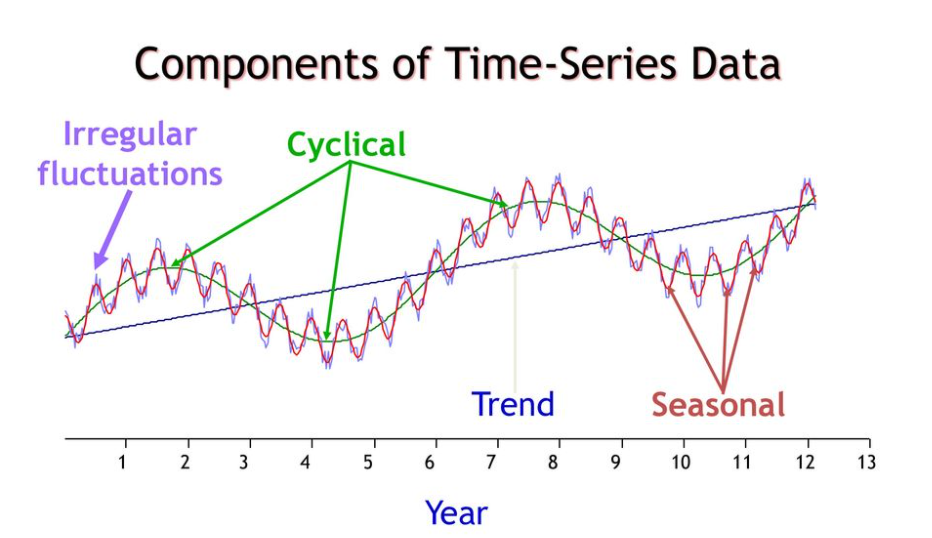

 

시계열 자료의 기초적인 개념에 대해 알아보겠습니다.  R 실습에 필요한 기초적인 개념만 다룰 것이며, 추후 필요한 개념은 따로 정리하겠습니다.

## 시계열 분석이란?

 시간에 따라 관측된 자료(data)를 **시계열 자료**라고 합니다. 많은 통계 분석 방법들이 데이터 관측값(sample)의 독립성을 가정하고 분석을 진행합니다. 하지만 시간에 따라 관측된 시계열 자료의 경우 **관측값들의 연관성**을 가지는 경우가 많기 때문에 시계열 분석을 진행하게 됩니다.

> 시계열 분석 단계는 모델링(Modeling), 예측(Forecasting), 설명(Explanation), 제어(Control)로 크게 4가지로 나눌 수 있습니다. 일반적으로 시계열 분석은 예측에 무게가 실립니다.

## 시계열 구성요인

 시계열 분석의 모델링 단계는 시계열 자료의 패턴, 즉 시계열 구성요인을 파악하는 것이라 볼 수 있습니다. 그렇다면 시계열 구성요인에는 어떤 것들이 있을까요? 다음과 같은 4가지로 구성됩니다. 

1. **추세 요인(Trend Factor)**은 인구변동, 인플레이션이나 디플레이션 등의 영향을 받아 시계열 자료에 영향을 주는 **장기 변동요인**입니다.

2. **순환 요인(Cycle Factor)**는 통상적으로 2년에서 10년의 **주기**를 가지고 순환하는 **중기 변동요인**입니다. 10년 미만 데이터의 경우 추세 요인과 순환 요인을 구분하기 어렵습니다. 그래서 데이터의 관측기간이 길지 않을 경우 추세 요인으로 묶어 분석하기도 합니다.

3. **계절 요인(Seasonal Factor)**은 주로 **1년을 주기**로 발생하는 변동요인입니다. 추세나 순환에 비해 상대적으로 단기 변동에 해당합니다.(분기나 월을 주기로 가질 수 있습니다.)

4. **불규칙 요인(Irregular Factor)**은 측정 및 예측이 어려운 오차변동을 의미합니다. 즉 위의 세 가지 요인으로 **설명하고 남은 변동**을 의미한다고 보아도 무방합니다.

  

 

앞서 설명한 구성요인으로 시계열을 모형화하여 나타낼 수 있습니다. 시계열 구성요인의 결합방법에 따라 **가법모형(Additive Model)**과 **승법모형(Multiplication Model)**로 구분합니다.  

- **가법 모형** : $f(x)= d^2_{3}$
-  

## 모형적인 관점에서의 시계열

앞서 설명한 구성요인으로 모형적인 관점에서 시계열을 나타낼 수 있습니다. 
